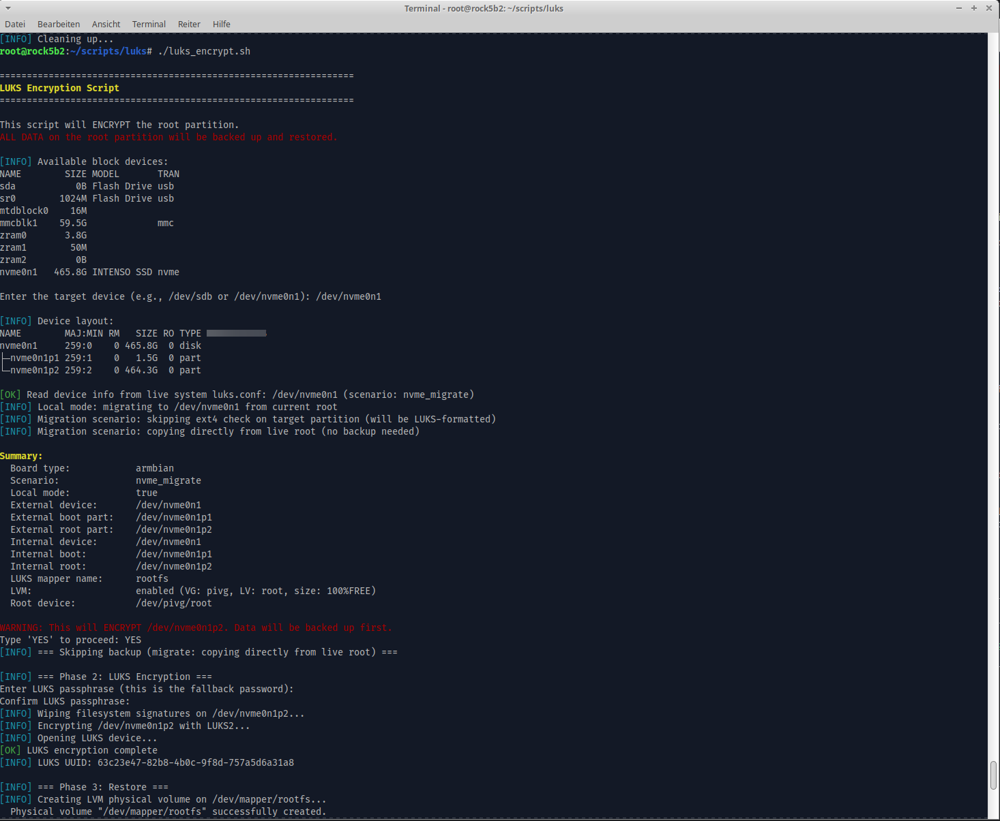
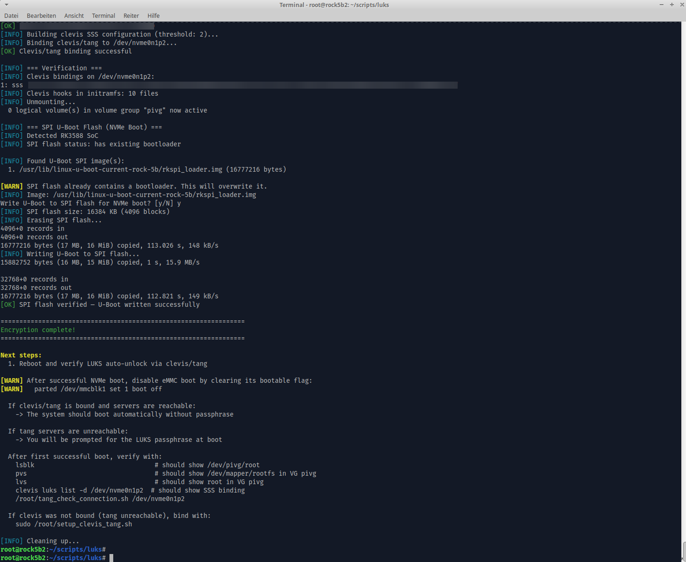
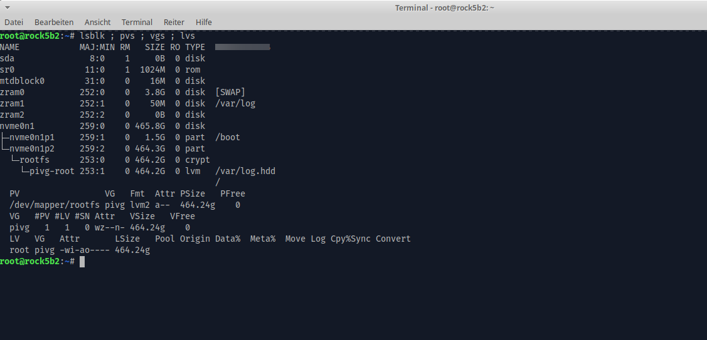
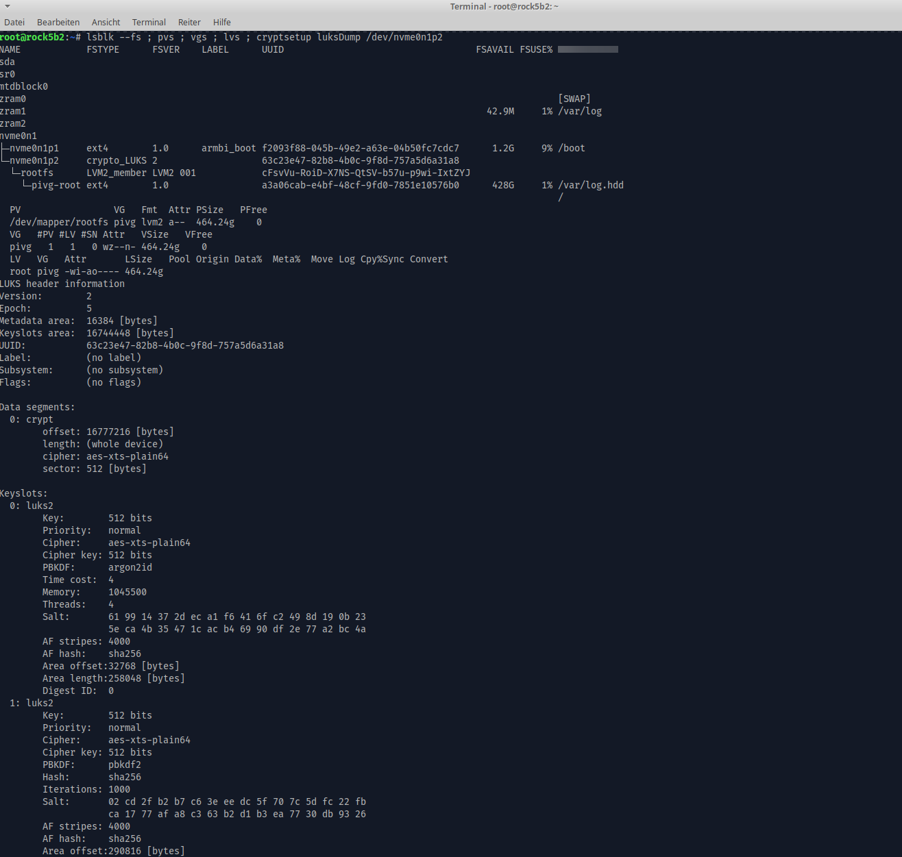
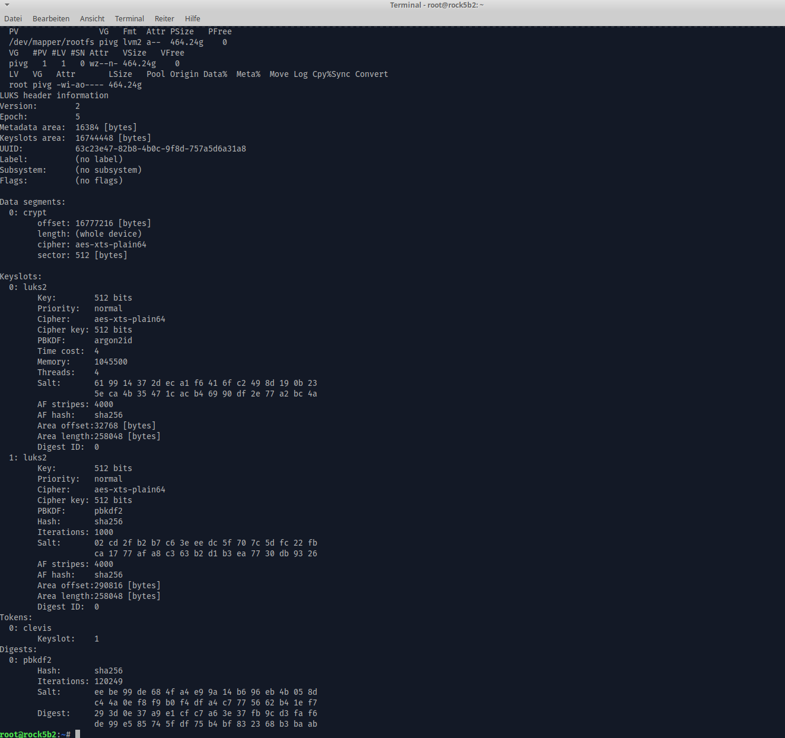
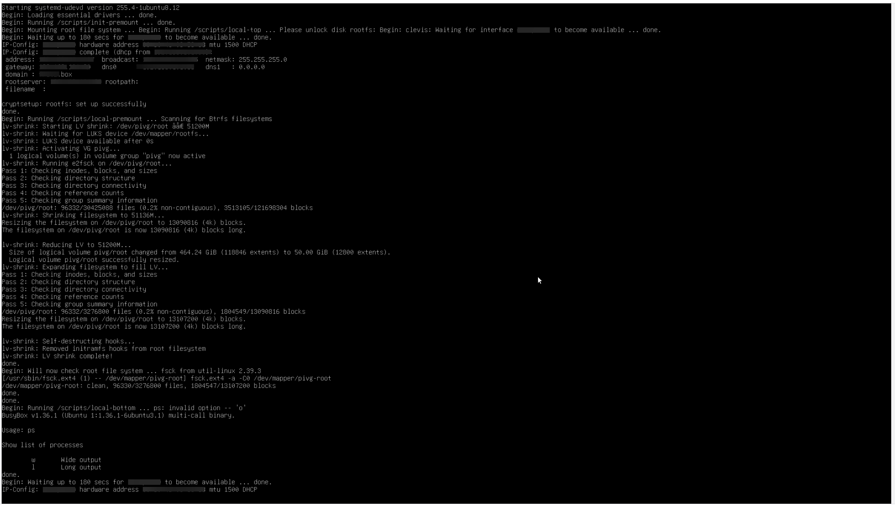
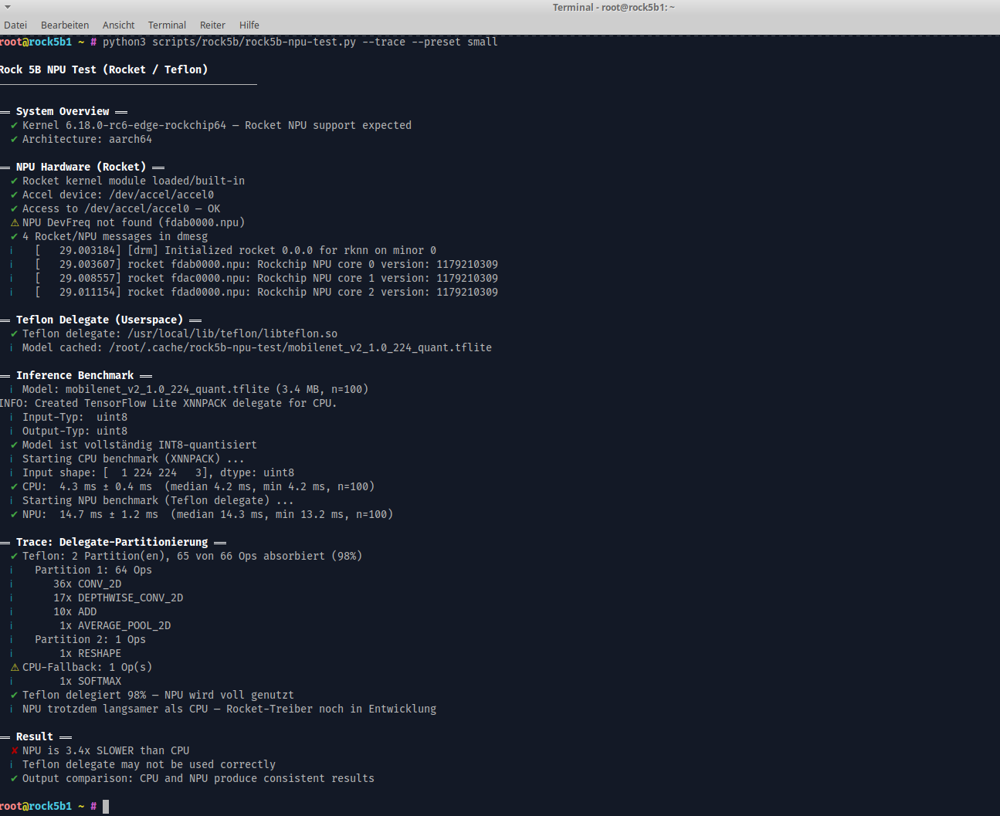

[](https://github.com/vroomfondel/sbcstuff/actions/workflows/mypynpytests.yml)
[](https://github.com/vroomfondel/sbcstuff/actions/workflows/checkblack.yml)


# sbcstuff

Standalone scripts for setting up LUKS full-disk encryption, NPU acceleration, and boot configuration on aarch64 single-board computers (Raspberry Pi, Rock 5B / RK3588).

These scripts were extracted from a larger infrastructure repo because the Rock 5B in particular requires significant preparation, tweaks, and domain knowledge to get encryption and NPU working — enough to warrant a dedicated repository.

## Contents

| Script | Purpose | Runs on |
|--------|---------|---------|
| `scripts/luks/luks_prepare.sh` | Prepare a board for LUKS encryption (packages, initramfs, boot config) | Target board (RPi / Rock 5B) |
| `scripts/luks/luks_encrypt.sh` | Encrypt root partition with LUKS + clevis/tang auto-unlock | External machine (RPi) or target board (Armbian NVMe/USB) or SD-booted board against eMMC |
| `scripts/luks/luks_boot_split.sh` | Split `/boot` into a separate partition (required for Armbian in-place encryption) | Target board (on-board mode) or external machine (external mode) |
| `scripts/luks/lv_shrink.sh` | Interactively shrink an LVM Logical Volume (ext4, offline or via initrd) | Target board |
| `scripts/luks/setup_clevis_tang.sh` | (Re-)bind clevis/tang NBDE on an already-encrypted LUKS device | Target board (already encrypted) |
| `scripts/luks/tang_check_connection.sh` | Test clevis/tang connectivity and decryption on a LUKS device | Target board (already encrypted) |
| `scripts/luks/initramfs_local-bottom_cleanup-netplan` | Initramfs hook: removes stale netplan YAML from boot-time DHCP | Automatisch im Initramfs (nicht manuell) |
| `scripts/rock5b/rock5b-hw-check.sh` | Hardware diagnostics for Rock 5B (NPU, GPU, SPI flash, boot chain) | Rock 5B |
| `scripts/rock5b/rock5b-usb-boot-setup.sh` | Interactive USB boot setup for Rock 5B (SPI flash + boot order) | Rock 5B |
| `scripts/rock5b/rock5b-npu-test.py` | NPU benchmark (Rocket/Teflon stack, kernel ≥6.18) | Rock 5B |
| `scripts/rock5b/build-mesa-teflon.sh` | Build Mesa libteflon.so (Rocket/RK3588 NPU) from source | Rock 5B (aarch64, native build) |
| `scripts/rock5b/release-mesa-teflon.sh` | Create a GitHub Release with libteflon.so tarball | Dev-Rechner oder Rock 5B (braucht `gh` CLI) |

### Makefile Targets (dev workstation)

| Target | Description |
|--------|-------------|
| `make teflon-fetch` | Fetch libteflon.so build artifacts from Rock 5B via rsync |
| `make teflon-release` | Fetch artifacts + create GitHub Release (requires `gh` CLI) |

Override the Rock 5B host: `make teflon-release ROCK5B_HOST=root@10.0.0.5`

See [README_ROCKCHIP_5b.md](README_ROCKCHIP_5b.md) for detailed Rock 5B hardware documentation (kernel options, NPU driver stacks, SPI flash, boot chain, device tree).

---

## LUKS Encryption Scripts

Standalone scripts for LUKS-encrypting root partitions with clevis/tang auto-unlock (Network-Bound Disk Encryption). Supports Raspberry Pi (SD card / NVMe) and Armbian/U-Boot boards (Rock 5B, etc.).

### Supported Boards

| Board | Boot mechanism | Boot partition | Boot config | Kernel postinst | SPI flash |
|-------|---------------|----------------|-------------|-----------------|-----------|
| Raspberry Pi | `/boot/firmware` (FAT32, separate partition) | Already separate | `cmdline.txt` + `config.txt` | Custom hook (initramfs-rebuild) | N/A |
| Armbian/U-Boot (Rock 5B) | `/boot` (ext4, on root partition) | Must be split out | `armbianEnv.txt` | Armbian's own hooks | Auto-offered for RK3588 NVMe/USB migration |

### Supported Scenarios

| Scenario | Board | Workflow |
|----------|-------|----------|
| A: RPi (external encrypt) | RPi | `prepare` on Pi → SD/NVMe out → `encrypt` on external machine |
| B: NVMe migration | Armbian | `prepare` AND `encrypt` both run on the board (NVMe != boot disk) |
| C: USB migration | Armbian | `prepare` AND `encrypt` both run on the board (USB SSD != boot disk) |
| D: In-place eMMC (on-board split) | Armbian | `boot_split` on board → reboot → `prepare` on board → boot from SD → `encrypt` against eMMC |
| E: In-place eMMC (external split) | Armbian | SD card out → `boot_split --external` on external machine → SD back → `prepare` on board → boot from SD → `encrypt` against eMMC |

### Storage Stack

**With LVM (default, `USE_LVM=true`):**

```
partition → LUKS → /dev/mapper/rootfs → LVM PV → VG "pivg" → LV "root" → /dev/pivg/root (ext4)
```

**Without LVM (`USE_LVM=false`):**

```
partition → LUKS → /dev/mapper/rootfs (ext4)
```

### Quick Start

#### Raspberry Pi

1. Copy both scripts to the Pi (e.g., to `/root/`)
2. Run `sudo ./luks_prepare.sh` on the Pi
3. Shut down, move SD/NVMe to an external Linux machine
4. Run `sudo ./luks_encrypt.sh` on the external machine
5. Put the storage back into the Pi and boot

#### Armbian NVMe Migration (e.g., Rock 5B)

1. Copy both scripts to the board (e.g., to `/root/`)
2. Run `sudo ./luks_prepare.sh` — choose "Migrate to NVMe"
3. NVMe is partitioned automatically (1.5GB boot + rest for LUKS)
4. Run `sudo ./luks_encrypt.sh` directly on the same board
   - On RK3588 boards: the script offers to flash U-Boot to SPI for NVMe boot
5. Reboot, verify NVMe boot, then disable eMMC boot (`parted /dev/mmcblk1 set 1 boot off`)

#### Armbian USB Migration (e.g., Rock 5B with USB SSD)

1. Copy both scripts to the board (e.g., to `/root/`)
2. Run `sudo ./luks_prepare.sh` — choose "Migrate to USB" from the menu
3. USB SSD is partitioned automatically (1.5GB boot + rest for LUKS)
4. Run `sudo ./luks_encrypt.sh` directly on the same board
   - On RK3588 boards: the script offers to flash U-Boot to SPI for USB boot
5. Reboot, verify USB boot, then disable eMMC boot (`parted /dev/mmcblk1 set 1 boot off`)

#### Armbian In-Place eMMC (on-board split)

1. Copy all scripts to the board
2. Run `sudo ./luks_boot_split.sh` — creates initramfs hooks for offline boot partition split
3. Reboot — the split happens automatically (root is shrunk offline in initramfs)
4. Run `sudo ./luks_prepare.sh` — choose "Encrypt current disk" (detects `/boot` exists)
5. Shut down, boot from SD card
6. Run `sudo ./luks_encrypt.sh` against the eMMC
7. Remove SD card and boot from encrypted eMMC

#### Armbian In-Place eMMC (external split)

Alternative: split the boot partition on an external machine without rebooting the board.

1. Remove the SD card from the board
2. Plug it into an external Linux machine
3. Run `sudo ./luks_boot_split.sh --external` (or `--external /dev/sdX` to specify the device)
4. Insert the SD card back into the board and boot
5. Run `sudo ./luks_prepare.sh` — choose "Encrypt current disk" (detects `/boot` exists)
6. Shut down, boot from another SD card
7. Run `sudo ./luks_encrypt.sh` against the eMMC
8. Remove SD card and boot from encrypted eMMC

### Configuration Variables

Both scripts share the same configuration block at the top. **Values must match between the two scripts.**

| Variable | Default | Description |
|---|---|---|
| `TANG_SERVERS` | `("" "")` | Tang server URLs for clevis binding. `luks_prepare.sh` writes them to `luks.conf`; `luks_encrypt.sh` reads them from there (prompted at runtime only if still empty) |
| `SSS_THRESHOLD` | `2` | Shamir's Secret Sharing threshold (number of tang servers required) |
| `LUKS_MAPPER_NAME` | `rootfs` | LUKS device mapper name (`/dev/mapper/<name>`) |
| `USE_LVM` | `true` | Enable LVM layer inside LUKS |
| `LVM_VG_NAME` | `pivg` | LVM volume group name (only when `USE_LVM=true`) |
| `LVM_LV_NAME` | `root` | LVM logical volume name (only when `USE_LVM=true`) |
| `LVM_ROOT_SIZE` | _(empty = 100%FREE)_ | LV size — override via `--lv-size=<size>` (e.g., `50G`, `50%FREE`) |

### Script Details

#### luks_prepare.sh

Runs **on the target board** as root. Prepares the system for encryption.

```bash
sudo ./luks_prepare.sh      # interactive — detects board and presents scenario menu
sudo ./luks_prepare.sh -h   # show help
```

**What it does:**

1. Detects board type (RPi via `/boot/firmware/config.txt`, Armbian via `/boot/armbianEnv.txt`); warns and asks confirmation on non-aarch64 architectures
2. Detects storage and determines scenario (RPi, NVMe migration, USB migration, in-place). On Armbian, presents a dynamic menu based on available NVMe/USB devices.
3. For NVMe/USB migration: partitions target device (1.5GB boot + rest), copies `/boot`. Idempotent: skips partitioning if the target is already partitioned from a previous run.
4. For in-place Armbian: requires separate `/boot` (directs user to `luks_boot_split.sh` if missing)
5. Detects network interface and driver
6. Installs packages: `cryptsetup`, `cryptsetup-initramfs`, `clevis`, `clevis-luks`, `clevis-initramfs`, `clevis-systemd`, `curl`, `jq`, `lvm2` (if LVM enabled)
7. Configures initramfs modules (`algif_skcipher`, `dm-crypt`, `aes_arm64`, `sha256`, `dm-mod` if LVM, plus the network driver)
8. Creates initramfs hooks (`copycrypttab`, `luks_hooks`, `cleanup-netplan` in `init-bottom`)
9. Configures initramfs networking (`DEVICE=<iface>`, `IP=:::::<iface>:dhcp`, `FSTYPE=ext4,vfat` for RPi / `FSTYPE=ext4` for Armbian)
10. Creates kernel postinst hook (RPi only — Armbian has its own hooks)
11. Stages boot configuration files to `/root/luks-staged/`:
    - RPi: `cmdline.txt` with `root=` and `cryptdevice=` parameters
    - Armbian: `armbianEnv.txt` with updated `rootdev=`
    - `crypttab` — maps LUKS device with `luks,initramfs` options
    - `fstab` — root and boot mounts updated for encrypted device paths
    - `luks.conf` — board type, device paths, scenario, tang server URLs (used by encrypt script)
    - `luks_encrypt.sh`, `tang_check_connection.sh`, `cleanup-netplan` — copies for deployment by encrypt script
12. Rebuilds initramfs
13. Tests tang server connectivity

#### luks_boot_split.sh

Standalone script for Armbian boards that need a separate `/boot` partition before LUKS encryption. Required for the in-place eMMC scenario because ext4 does not support online shrinking — the root filesystem must be resized offline.

**Two modes:**

- **On-board mode** (default on live Armbian): Installs initramfs hooks; the split happens at next reboot when root is unmounted.
- **External mode** (`--external` or auto-detected when not on Armbian): Splits the partition directly on an unmounted SD card — no reboot needed.

**Two partition strategies** (auto-selected based on available space):

- **Append strategy** (free space ≥ 1536MB after root): Grows root partition, places `/boot` at the end of disk. No filesystem shrink needed.
- **Shrink strategy** (insufficient free space after root): Shrinks root filesystem and partition by 1536MB, creates `/boot` in the freed space.

**Usage:**

```bash
sudo ./luks_boot_split.sh                      # on-board mode (live Armbian)
sudo reboot                                    # split happens automatically during boot

sudo ./luks_boot_split.sh --external           # external mode (auto-detect device)
sudo ./luks_boot_split.sh --external /dev/sdX  # external mode (explicit device)
sudo ./luks_boot_split.sh --external=/dev/sdX  # external mode (alternate syntax)

sudo ./luks_boot_split.sh -h                   # show help
```

**CLI flags:**

| Flag | Description |
|------|-------------|
| `--external` | Force external mode, auto-detect removable device |
| `--external /dev/sdX` | External mode with explicit device |
| `--external=/dev/sdX` | Same, alternate syntax |
| `-h`, `--help` | Show help and exit |

**External mode** auto-activates when not running on an Armbian system (no `/boot/armbianEnv.txt`). It auto-detects removable/USB block devices, excluding the host root disk. If multiple candidates are found, it presents a selection menu.

##### On-board mode

**What it does on the live system:**

1. Detects board, root device, partition layout
2. Validates: Armbian only, no existing `/boot` partition, enough space (>4GB after split)
3. Detects free space after root partition and selects strategy (append or shrink)
4. Installs `parted` and `e2fsprogs` if needed
5. Creates initramfs hook (`/etc/initramfs-tools/hooks/boot-split`) — includes `resize2fs`, `e2fsck`, `mkfs.ext4`, `parted`, `blkid` in the initramfs image
6. Creates one-shot `local-premount` script (`/etc/initramfs-tools/scripts/local-premount/boot-split`) with baked-in partition values and selected strategy
7. Rebuilds initramfs

**What happens at next boot (in initramfs, root unmounted):**

*Append strategy (free space available):*

1. `parted resizepart` grows root partition up to the boot reservation boundary
2. `parted mkpart` + `mkfs.ext4 -L armbi_boot` creates boot partition at end of disk
3. Mounts root temporarily → copies `/boot/` → sets `legacy_boot` flag on boot partition (U-Boot priority) → adds `/boot` UUID to fstab → unmounts
4. `e2fsck` + `resize2fs` expands root filesystem to fill grown partition
5. Self-destructs: removes its hook and premount script from the root filesystem

*Shrink strategy (insufficient free space):*

1. `e2fsck -f -y` the root partition
2. `resize2fs` shrinks filesystem offline (the key difference from the old online approach)
3. `parted resizepart` shrinks root partition (uses `yes | parted ---pretend-input-tty` to handle confirmation prompt)
4. `parted mkpart` + `mkfs.ext4 -L armbi_boot` creates new boot partition
5. Mounts root temporarily → copies `/boot/` → sets `legacy_boot` flag on boot partition (U-Boot priority) → adds `/boot` UUID to fstab → unmounts
6. `resize2fs` expands root back to fill its (now smaller) partition
7. Self-destructs: removes its hook and premount script from the root filesystem

Error recovery exits 0 at each step to never block boot. After reboot, `lsblk` shows two partitions and `/boot` is mounted. Run `luks_prepare.sh` next — it detects `/boot` exists and proceeds normally.

##### External mode

Performs the split directly on an unmounted device — no initramfs hooks or reboot needed.

**What it does:**

1. Validates: device not the host root disk, exactly 1 partition, Armbian root (`armbianEnv.txt` present)
2. Detects free space after root partition and selects strategy (append or shrink)
3. Performs the split directly:
   - *Append strategy:* Grows root partition → creates boot partition at end → formats → copies `/boot` → sets `legacy_boot` flag → updates fstab → expands root filesystem
   - *Shrink strategy:* `e2fsck` → shrinks filesystem → shrinks partition → creates boot partition → formats → copies `/boot` → sets `legacy_boot` flag → updates fstab → expands root filesystem
4. Shows final partition layout

After external split, insert the SD card back into the board. `/boot` will mount automatically on boot. Run `luks_prepare.sh` next.

#### lv_shrink.sh

Interactive script for shrinking LVM Logical Volumes with ext4 filesystems. ext4 does not support online shrinking — for mounted/root partitions, the script installs initramfs hooks that perform the shrink offline at next boot (same pattern as `luks_boot_split.sh`).

**Two paths:**

- **Path A — Direct offline shrink** (ext4, not mounted): `e2fsck` → `resize2fs` → `lvreduce` → `resize2fs` (expand to fill LV)
- **Path B — initrd approach** (mounted or root LVs): installs initramfs hooks, shrink happens at next boot before root is mounted

**Usage:**

```bash
sudo ./lv_shrink.sh              # interactive mode
sudo ./lv_shrink.sh --dry-run    # show what would be done (both paths)
sudo ./lv_shrink.sh -h           # show help
```

**CLI flags:**

| Flag | Description |
|------|-------------|
| `--dry-run` | Show all commands/hook content without making changes |
| `-h`, `--help` | Show help and exit |

**What it does (interactive flow):**

1. Lists all Logical Volumes with size, filesystem type, and mount points (handles multiple mount points, e.g., `/` + bind mounts)
2. Prompts for LV selection (bounds-checked numbered menu)
3. Validates filesystem: only ext4 supported (fails with hint for XFS/btrfs)
4. Prompts for target size — absolute (`20G`, `10240M`) or reduction (`-5G`, `-2048M`). Validates against minimum size (512 MiB), used space, and warns when free space after shrink is tight (<512 MiB)
5. Decides path based on mount status:
   - Not mounted → Path A (direct)
   - Root (`/`) → Path B (initrd, automatic)
   - Mounted, not root → user chooses: unmount or initrd (falls back to initrd if unmount fails)
6. Shows summary and requires `YES` confirmation

**Path A — Direct offline shrink:**

1. `e2fsck -f -y` — filesystem check
2. `resize2fs` to target minus 64 MiB buffer
3. `lvreduce --force` to target size (on failure: `resize2fs` rollback to restore full size)
4. `resize2fs` — expand filesystem to fill LV (removes buffer)

**Path B — initrd approach:**

Installs two files:

- **Hook** (`/etc/initramfs-tools/hooks/lv-shrink`): `copy_exec` for `e2fsck`, `resize2fs`, `blkid`, `lvm`
- **local-premount script** (`/etc/initramfs-tools/scripts/local-premount/lv-shrink`): baked-in values (`TARGET_DEV`, `VG_NAME`, `FS_TARGET_MB`, `TARGET_SIZE_MB`), error trap that exits 0 (never blocks boot)

Rebuilds initramfs with `update-initramfs -u -k all`, then verifies that `lvm`, `e2fsck`, and `resize2fs` are present in the initrd via `lsinitramfs`.

**At next boot (in initramfs):**

1. `lvm vgchange -ay` — activate VG
2. `e2fsck -f -y` — filesystem check
3. `resize2fs -f` to target minus buffer (`-f` forces past `needs_recovery` journal flag, safe after `e2fsck`)
4. `lvreduce --force` (on failure: `resize2fs -f` rollback, `exit 0` to continue boot)
5. `resize2fs -f` — expand filesystem to fill LV
6. Self-destruct: mounts root, removes hook + premount script, writes log to `/var/log/lv-shrink-initrd.log`

All critical commands (`e2fsck`, `resize2fs`, `lvreduce`) redirect stderr to the log file for post-boot debugging.

**Post-boot verification:**

```bash
lvs                                           # check new LV size
df -h                                         # check filesystem size
cat /var/log/lv-shrink-initrd.log             # check shrink log
ls /etc/initramfs-tools/hooks/lv-shrink       # should be gone (self-destruct)
```

#### luks_encrypt.sh

Runs on an **external machine** (RPi), or **locally on the same board** (Armbian NVMe/USB migration), or from **SD card against eMMC** (Armbian in-place).

**Usage:**

```bash
sudo ./luks_encrypt.sh                                          # full run
sudo ./luks_encrypt.sh --lv-size=50G                            # set root LV size (default: 100%FREE)
sudo ./luks_encrypt.sh --spi-only                               # flash U-Boot to SPI only (skip encryption)
sudo ./luks_encrypt.sh --start-phase=clevis                     # resume from clevis binding phase
sudo ./luks_encrypt.sh --start-phase=restore --backup-dir=/tmp/luks-backup.abc123  # resume restore with explicit backup
sudo ./luks_encrypt.sh --list-phases                            # show available phases
sudo ./luks_encrypt.sh -h                                       # show help
```

**CLI flags:**

| Flag | Description |
|------|-------------|
| `--start-phase=<name\|num>` | Resume from a specific phase (by name or number 1-8). Auto-sets up prerequisites (opens LUKS, mounts partitions, locates backup). |
| `--backup-dir=<path>` | Specify backup directory explicitly (required when resuming if multiple backups exist). |
| `--lv-size=<size>` | Set root LV size instead of 100%FREE (e.g., `50G`, `50%FREE`). Only applies when `USE_LVM=true`. |
| `--list-phases` | Print all phases with descriptions and exit. |
| `--spi-only` | Skip all encryption, run only the SPI U-Boot flash for RK3588 NVMe/USB boot. |
| `-h`, `--help` | Show help and exit. |

**Modes:**

- **Local mode** (auto-detected when encrypt target is the boot disk, or for NVMe/USB migration scenarios): copies directly from live root via `rsync --exclude` (no intermediate backup needed for migration), no cross-arch chroot needed, tang servers directly reachable
- **External mode** (RPi default): mounts target root read-only for backup, may need `qemu-user-static` for cross-arch chroot

**Device auto-detection:**

- **Running from the storage itself**: auto-detects the external device, reads `luks.conf` for internal paths and board type, copies itself to `/tmp`, unmounts storage, re-executes from `/tmp`.
- **Running from a local copy**: mounts the target root read-only to read `luks.conf`.
- **Corrupted root from previous failed run**: if the root partition can't be mounted (e.g., after a failed `cryptsetup luksFormat`), falls back to reading `luks.conf` from an existing backup directory in `/tmp`.
- **Fallback**: prompts interactively.

**Phases:**

The script is organized into 8 resumable phases. Each phase is gated — when using `--start-phase`, earlier phases are skipped and prerequisites (LUKS open, mounts, backup directory) are automatically set up.

| # | Phase | Description |
|---|-------|-------------|
| 1 | `detect` | Device detection, board type, confirmation |
| 2 | `backup` | Root partition backup via rsync (skipped for NVMe/USB migration — data is copied directly in restore phase) |
| 3 | `encrypt` | Stale device cleanup, `wipefs`, LUKS2 format + open with user-provided passphrase |
| 4 | `restore` | Create filesystem (+ LVM if enabled), rsync restore, file count verification |
| 5 | `bootconfig` | Board-specific boot config: RPi (`cmdline.txt` + `config.txt`), Armbian (`armbianEnv.txt`), both (`/etc/crypttab`, `/etc/fstab`, `cleanup-netplan` hook, `tang_check_connection.sh`) |
| 6 | `initramfs` | Chroot + `update-initramfs`; Armbian also ensures `uInitrd` (U-Boot wrapped) via `mkimage` |
| 7 | `clevis` | Clevis/Tang SSS binding (prompts for LUKS passphrase if not already available) |
| 8 | `verify` | Verification (clevis bindings, initramfs hooks), cleanup, SPI U-Boot flash (RK3588 NVMe/USB migration) |

**Resuming after failure:**

If the script fails mid-run, you can resume from the failed phase without re-doing earlier steps:

```bash
# Example: clevis binding failed because tang was down — resume just that phase
sudo ./luks_encrypt.sh --start-phase=clevis

# Example: restore phase failed — resume with explicit backup directory
sudo ./luks_encrypt.sh --start-phase=restore --backup-dir=/tmp/luks-backup.abc123
```

When resuming, the script automatically:
- Opens the LUKS device (prompts for passphrase if needed)
- Activates LVM if configured
- Mounts the encrypted root and boot partitions
- Locates the backup directory (or uses `--backup-dir`)
- Skips partition-mounted checks for phases past `encrypt`

**Standalone SPI flash mode:**

```bash
sudo ./luks_encrypt.sh --spi-only
```

Skips all encryption steps and runs only the SPI U-Boot flash for NVMe/USB boot. Useful when the encryption was already completed but SPI was not flashed (or needs re-flashing). Detects RK3588 SoC, checks `/dev/mtdblock0`, finds images in `/usr/lib/linux-u-boot-*/` (`rkspi_loader*.img` or `u-boot-rockchip-spi*.bin`). If multiple SPI images are found, presents a selection menu.

**Prerequisites:**

- `cryptsetup`, `clevis`, `clevis-luks`, `rsync`, `curl`, `jq`, `mkfs.ext4`, `wipefs`
- `mkimage` (from `u-boot-tools` — required for Armbian `uInitrd` creation)
- `lvm2` (if `USE_LVM=true`)
- `qemu-user-static` (only if external mode host is not aarch64)

#### setup_clevis_tang.sh

Standalone script for (re-)binding clevis/tang NBDE on an already-encrypted LUKS device. Useful when tang servers were unreachable during encryption, when tang server URLs change, or when rebinding is needed after key rotation.

```bash
sudo /root/setup_clevis_tang.sh                # interactive — prompts for all values
sudo /root/setup_clevis_tang.sh <passphrase>   # non-interactive LUKS passphrase
```

**Configuration variables** at the top of the script (leave empty to be prompted interactively):

| Variable | Default | Description |
|---|---|---|
| `LUKS_DEVICE` | _(empty)_ | LUKS partition (e.g. `/dev/nvme0n1p2`). Auto-detected from `/etc/crypttab` if empty. |
| `NETWORK_INTERFACE` | _(empty)_ | Network interface for initramfs (e.g. `eth0`, `end0`) |
| `TANG_SERVERS` | `("" "")` | Tang server URLs |
| `SSS_THRESHOLD` | `2` | Shamir's Secret Sharing threshold |
| `IP_METHOD` | `dhcp` | Initramfs IP config (`dhcp` or full kernel `ip=` string) |

**What it does:**

1. Auto-detects LUKS device from `/etc/crypttab` (resolves `UUID=` entries via `blkid`), falls back to interactive prompt
2. Detects network driver for the specified interface
3. Checks existing clevis bindings — **idempotent**: if tang server URLs already match the configured `TANG_SERVERS`, exits with "Nothing to do" instead of rebinding
4. If bindings exist but differ: asks whether to remove and rebind
5. Verifies tang server connectivity
6. Builds SSS config and binds clevis/tang (fetches `/adv` from each server)
7. Configures initramfs networking (`DEVICE=`, `IP=`, network driver module)
8. Rebuilds initramfs
9. Verifies bindings and initramfs contents

#### tang_check_connection.sh

Quick diagnostic script to test whether clevis/tang can successfully decrypt a LUKS device. Tests each clevis slot individually and reports timing.

```bash
sudo /root/tang_check_connection.sh /dev/nvme0n1p2
```

**What it does:**

1. Lists all clevis bindings on the device
2. For each `tang` or `sss` slot: runs `clevis luks pass` with a 15-second timeout
3. Reports success/failure and decryption duration per slot

Deployed automatically to `/root/tang_check_connection.sh` on the target system by `luks_encrypt.sh` (Phase 5).

### Post-Boot Verification

```bash
# Show the storage stack
lsblk

# Verify LUKS is active
cryptsetup status rootfs

# LVM verification (if USE_LVM=true)
pvs
lvs

# Show clevis/tang SSS binding
clevis luks list -d /dev/mmcblk0p2    # RPi SD
clevis luks list -d /dev/nvme0n1p2    # NVMe

# Test tang connectivity and decryption
sudo /root/tang_check_connection.sh /dev/<partition>

# RK3588: Verify SPI flash content
dd if=/dev/mtdblock0 bs=512 count=1 2>/dev/null | od -t x1 | head -4
```

### Troubleshooting

**Tang servers unreachable at boot:**
Fall back to LUKS passphrase prompt. Once booted, bind clevis/tang:
```bash
sudo /root/setup_clevis_tang.sh
```
Then verify with: `sudo /root/tang_check_connection.sh /dev/<partition>`

**Clevis binding failed during encryption:**
Resume just the clevis phase: `sudo ./luks_encrypt.sh --start-phase=clevis`.

**Wrong network interface detected:**
Re-run `luks_prepare.sh` after connecting the correct interface, or manually edit `/etc/initramfs-tools/initramfs.conf` (`DEVICE=` and `IP=` lines) and rebuild initramfs with `update-initramfs -u -k all`.

**Insufficient space for backup:**
The encrypt script checks available space in `/tmp` and prompts for an alternative directory.

**Cross-architecture chroot fails (RPi external mode):**
```bash
sudo apt install qemu-user-static
```

**`luks_boot_split.sh`: parted gotchas (both modes):**
Two issues with GNU parted:
- `parted unit MiB print` outputs decimal values (e.g., `16.0MiB`). Bash arithmetic fails on floats — the script pipes through `cut -d. -f1` to truncate.
- `parted -s resizepart` does **not** auto-confirm the "Shrinking a partition can cause data loss" warning, even in scripted mode. The script uses `yes | parted ---pretend-input-tty` instead (shrink strategy only).

**`luks_boot_split.sh`: initramfs scripts don't run (on-board mode only):**
initramfs-tools `run_scripts()` sources the ORDER file, which calls scripts as subprocesses. To debug, add `exec > /run/boot-split.log 2>&1` at the top of the premount script — the log survives into the booted system at `/run/boot-split.log`. Also verify that the hook (which copies `parted`, `resize2fs`, etc. into the initramfs) wasn't removed by a previous failed run's self-destruct.

**`luks_boot_split.sh`: external mode device not detected:**
The auto-detection looks for devices with `usb` or `mmc` transport, plus `sd*` devices with existing partitions. If your card reader is not detected, specify the device explicitly: `sudo ./luks_boot_split.sh --external /dev/sdX`.

**RK3588: Board still boots from eMMC/SD after SPI flash:**
U-Boot scans eMMC/SD before NVMe/USB. Disable the old boot by clearing the bootable flag:
```bash
parted /dev/mmcblk1 set 1 boot off    # or mmcblk0, depending on the board
```
Or remove the SD card physically if that's the boot source.

**RK3588: SPI device not found (`/dev/mtdblock0` missing):**
```bash
modprobe spi-rockchip-sfc
```

**RK3588: No U-Boot SPI images found:**
Install the board's u-boot package:
```bash
apt list --installed 'linux-u-boot-*'    # check what's installed
apt install linux-u-boot-rock-5b-current  # example for Rock 5B
```

**Netplan DHCP conflicts after boot (OVS/bridge ports get DHCP):**
The initramfs DHCP configuration for clevis/tang can persist into userspace via `/run/netplan/`. The `cleanup-netplan` hook (deployed to `init-bottom` by `luks_prepare.sh` and `luks_encrypt.sh`) removes stale netplan YAML files automatically. If the hook is missing:
```bash
rm -rf /run/netplan/*
# Then install the hook permanently:
cp scripts/luks/initramfs_local-bottom_cleanup-netplan /etc/initramfs-tools/scripts/init-bottom/cleanup-netplan
chmod 755 /etc/initramfs-tools/scripts/init-bottom/cleanup-netplan
update-initramfs -u -k all
```

**Armbian: uInitrd missing after initramfs rebuild:**
```bash
KVER=$(uname -r)
mkimage -A arm64 -T ramdisk -C gzip -n "uInitrd ${KVER}" -d /boot/initrd.img-${KVER} /boot/uInitrd-${KVER}
ln -sf uInitrd-${KVER} /boot/uInitrd
```

---

## Hardware Diagnostics (Rock 5B)

### rock5b-hw-check.sh

Hardware diagnostic script for Rock 5B (RK3588) boards running Armbian. Checks NPU, GPU, SPI flash, and boot configuration.

```bash
sudo ./scripts/rock5b/rock5b-hw-check.sh          # read-only diagnostics
sudo ./scripts/rock5b/rock5b-hw-check.sh --fix    # attempt to fix issues (remove bad overlays, load modules)
```

**Checks performed:**

| Section | What it checks |
|---------|---------------|
| System overview | Hostname, kernel version, Armbian release, vendor vs mainline kernel detection |
| SPI flash & boot source | SPI content analysis, boot chain tracing, available boot media |
| Boot config | `armbianEnv.txt` overlays, harmful NPU overlay detection |
| NPU status | Rocket accel device (`/dev/accel/accel0`), DRM device (`/dev/dri/by-path/platform-fdab0000.npu-render`), legacy `/dev/rknpu*`, kernel module/built-in (rocket or rknpu), devfreq frequencies, dmesg |
| GPU status | Mali G610 DRM device, driver detection (mali/panfrost/panthor/bifrost), utilization |
| DRI overview | All `/dev/dri/by-path/*-render` devices with driver names |

**SPI flash analysis:**

The script extracts detailed information from the SPI flash (`/dev/mtdblock0`):

- **Rockchip idbloader magic** — detects RKNS signature (`0x524B4E53`) at offset 0 and reads the idbloader sector count
- **GPT partition table** — detects EFI PART signature at offset 0x200
- **U-Boot version & build date** — extracts plaintext version strings (e.g., `U-Boot 2024.01-armbian-rk3588`) and build timestamps via `strings`
- **SPI loader type classification** — idbloader + GPT (standard NVMe boot), idbloader legacy, GPT only, or unknown
- **Checksum comparison** — computes MD5 of SPI flash content and compares against installed SPI images in `/usr/lib/linux-u-boot-*/` to detect whether the flash is up to date
- **Version comparison** — if flash and image differ, shows both U-Boot version strings side by side

**Boot chain tracing:**

Shows how the boot source is determined, not just what it is:

- **Kernel `root=`** — the root device parameter passed by U-Boot to the kernel (`/proc/cmdline`)
- **U-Boot `boot_targets`** — the device scan order (e.g., `mmc1 mmc0 nvme0 usb0`) via `fw_printenv`
- **U-Boot `devtype`/`devnum`** — the device U-Boot actually selected
- **`armbianEnv.txt rootdev`** — explicit root override if set
- **DeviceTree SPL boot device** — which device the Secondary Program Loader booted from (`/proc/device-tree/chosen/u-boot,spl-boot-device`)
- **Available boot media** — lists all block devices (eMMC, NVMe, SD, USB) with size and model, marking the active boot source

**Fix mode (`--fix`):**

- Removes harmful NPU overlays from `armbianEnv.txt` and `/boot/overlay-user/*.dtbo` files
- Attempts to load NPU kernel module if not active (`modprobe rocket` on ≥6.18, `modprobe rknpu` on older kernels)
- **Kernel upgrade** (when on older mainline without NPU/GPU support): searches available Armbian kernel packages (edge, current, vendor), shows candidates with versions, and offers to install the recommended package. Requires explicit `YES` confirmation. Also installs the matching DTB package if available. Prioritizes edge kernel (≥6.18 with mainline panthor + RKNPU) over vendor BSP.
- **SPI bootloader update** (optional, after kernel upgrade): the SPI U-Boot is largely independent of the kernel — it initializes hardware and loads kernel/DTB/initramfs from `/boot/`. An update is usually not required but recommended when booting from NVMe/USB with a U-Boot older than 2023.01 (known boot issues). The script searches for matching `linux-u-boot-*` packages, explains that the update is optional, and uses a two-step confirmation: `y/N` to install the package, then `YES` to actually flash `/dev/mtdblock0`. Includes pre/post flash checksum verification. Skips if SPI already matches the image.

**Kernel support tiers:**

| Kernel | GPU driver | NPU (RKNPU) | Notes |
|--------|-----------|-------------|-------|
| Vendor/BSP 6.1.x | mali (blob) | Built-in (DRM, 0.9.x) | Rockchip patches, stable but older |
| Mainline 6.12–6.13 | panthor | Not yet | panthor replaces panfrost for Valhall |
| Mainline 6.14–6.17 | panthor | Experimental | RKNPU merged but not yet stable |
| **Mainline ≥6.18** | **panthor** | **Stable** | **Recommended — full NPU+GPU, better security** |
| Mainline <6.12 | panfrost (limited) | No | Mali G610 poorly supported |

**NPU notes:**

The vendor kernel (6.1.x) includes RKNPU driver 0.9.x which uses the DRM subsystem (`/dev/dri/renderD129`). The old `/dev/rknpu*` path no longer exists. The vendor DTB already enables the NPU — adding NPU overlays causes `can't request region for resource` conflicts.

Mainline kernels ≥6.18 include both panthor (Mali G610 GPU) and RKNPU drivers natively, making the vendor kernel no longer necessary for full hardware support.

### rock5b-usb-boot-setup.sh

Interactive script for setting up USB boot on the Rock 5B. Checks SPI flash status, flashes U-Boot to SPI if needed, and configures the boot order (USB before SD/eMMC) via `fw_setenv`.

```bash
sudo ./scripts/rock5b/rock5b-usb-boot-setup.sh
```

Requires a running Armbian installation on SD card.

### rock5b-npu-test.py

NPU acceleration benchmark for Rock 5B with mainline kernel ≥6.18 (Rocket driver + Mesa Teflon TFLite delegate).

```bash
python3 scripts/rock5b/rock5b-npu-test.py                    # full test (default: large preset)
python3 scripts/rock5b/rock5b-npu-test.py --preset small      # small model (MobileNet v2, ~3.4 MB)
python3 scripts/rock5b/rock5b-npu-test.py --preset xlarge     # extra large (Inception v4, ~41 MB)
python3 scripts/rock5b/rock5b-npu-test.py --check-only        # system checks only, no inference
python3 scripts/rock5b/rock5b-npu-test.py --model /path/to/model.tflite  # custom model
```

**Requires:** `libteflon.so` (Mesa Teflon delegate — build with `build-mesa-teflon.sh` or download from GitHub Release). Python dependencies (`tensorflow-aarch64`, `numpy`) are auto-installed on first run.

**Model presets** (INT8 quantized, downloaded from Google Coral test data):

| Preset | Model | Size | Description |
|--------|-------|------|-------------|
| `small` | MobileNet v2 | ~3.4 MB | Fast, low compute |
| `medium` | MobileNet v1 | ~4.3 MB | Medium compute |
| **`large`** (default) | SSD MobileNet v2 | ~6.5 MB | Object detection, high compute |
| `xlarge` | Inception v4 | ~41 MB | Very high compute |

**What it does:**
- System checks: kernel version, `/dev/accel/accel0` presence, rocket module, NPU devfreq, Teflon delegate location
- Downloads the selected model preset (cached in `~/.cache/rock5b-npu-test/`)
- Runs CPU baseline (XNNPACK, 4 threads) and NPU (Teflon delegate) inference in isolated subprocess, compares throughput and output consistency

### build-mesa-teflon.sh

Builds Mesa `libteflon.so` (the TFLite delegate for the Rocket/RK3588 NPU driver) from source. Installs **only** `libteflon.so` to `/usr/local/lib/teflon/` — system Mesa (GPU/display) is not touched.

```bash
sudo ./scripts/rock5b/build-mesa-teflon.sh              # build + install
sudo ./scripts/rock5b/build-mesa-teflon.sh --deps-only  # install build dependencies only
sudo ./scripts/rock5b/build-mesa-teflon.sh --no-deps    # skip apt (dependencies already present)
sudo ./scripts/rock5b/build-mesa-teflon.sh --package    # build + tarball for GitHub Release (no system install)
sudo ./scripts/rock5b/build-mesa-teflon.sh --jobs=N     # override parallel jobs (default: nproc)
sudo ./scripts/rock5b/build-mesa-teflon.sh -h           # show help
```

**What it does:**

1. Installs build dependencies (via `apt-get build-dep mesa` or manual fallback package list)
2. Clones Mesa at the pinned version tag (`mesa-25.3.5`) to `/tmp/mesa-teflon-build/`
3. Configures Meson with `-Dgallium-drivers=rocket -Dteflon=true` (no Vulkan, no GLX, no platform backends)
4. Builds and installs `libteflon.so` to `/usr/local/lib/teflon/`

**Package mode** (`--package`): creates a standalone `libteflon.so` plus a tarball with `BUILD_INFO.txt` (Mesa version, kernel, GCC, distribution). Use `release-mesa-teflon.sh` to publish as GitHub Release.

**Configuration:** `MESA_VERSION` at the top of the script must match between `build-mesa-teflon.sh` and `release-mesa-teflon.sh`.

### release-mesa-teflon.sh

Creates a GitHub Release with the `libteflon.so` build artifacts from `build-mesa-teflon.sh --package`.

```bash
./scripts/rock5b/release-mesa-teflon.sh [DIST_DIR]    # default: /tmp/mesa-teflon-build/dist
```

**Typical workflow:**

```bash
# On Rock 5B:
sudo ./build-mesa-teflon.sh --package
# Optional: copy artifacts to dev machine
scp /tmp/mesa-teflon-build/dist/* user@workstation:sbcstuff/

# On dev machine (or Rock 5B):
./release-mesa-teflon.sh /tmp/mesa-teflon-build/dist
```

**Requires:** `gh` CLI (installed and authenticated via `gh auth login`), git remote pointing to the GitHub repository.

Creates release tag `teflon-v<version>` (e.g., `teflon-v25.3.5`) with install instructions in the release body.

## Screenshots — LUKS Encryption on Rock 5B (NVMe Migration)

Full run of `luks_encrypt.sh` on a Rock 5B with NVMe migration, LUKS2 + LVM + clevis/tang auto-unlock. Sensitive data (hostnames, tang URLs, UUIDs) redacted with `blurimage.py`.

### Encryption start — device detection and backup



### Phases 4–8 — restore, bootconfig, initramfs, clevis, verify


### Completion — clevis binding, SPI flash, post-run summary



### Post-boot verification — lsblk, LVM, storage stack



### LUKS header and keyslot details





## Screenshots — LV Shrink via initrd (Rock 5B, LUKS + LVM)

`lv_shrink.sh` initrd path on a Rock 5B — shrinking root LV from 464G to 50G on a LUKS-encrypted NVMe (clevis/tang auto-unlock). Shows LUKS wait, e2fsck, resize2fs, lvreduce, expand, and self-destruct. Sensitive data redacted with `blurimage.py`.

### Successful initrd shrink — full boot log



---

## Screenshots — NPU Benchmark on Rock 5B (Rocket / Teflon)

`rock5b-npu-test.py` with `--trace` on a Rock 5B (RK3588, mainline kernel 6.18, Rocket driver, Mesa Teflon delegate). Shows delegate partition analysis and `benchmark_model` op profiling for validation.

### Delegate partition trace (--trace --preset small)



### benchmark_model op profiling (validation)


## License
This project is licensed under the LGPL where applicable/possible — see [LICENSE.md](LICENSE.md). Some files/parts may use other licenses: [MIT](LICENSEMIT.md) | [GPL](LICENSEGPL.md) | [LGPL](LICENSELGPL.md). Always check per‑file headers/comments.


## Authors
- Repo owner (primary author)
- Additional attributions are noted inline in code comments


## Acknowledgments
- Inspirations and snippets are referenced in code comments where appropriate.

---

## ⚠️ Note

This is a development/experimental project. For production use, review security settings, customize configurations, and test thoroughly in your environment. Provided "as is" without warranty of any kind, express or implied, including but not limited to the warranties of merchantability, fitness for a particular purpose and noninfringement. In no event shall the authors or copyright holders be liable for any claim, damages or other liability, whether in an action of contract, tort or otherwise, arising from, out of or in connection with the software or the use or other dealings in the software. Use at your own risk.

